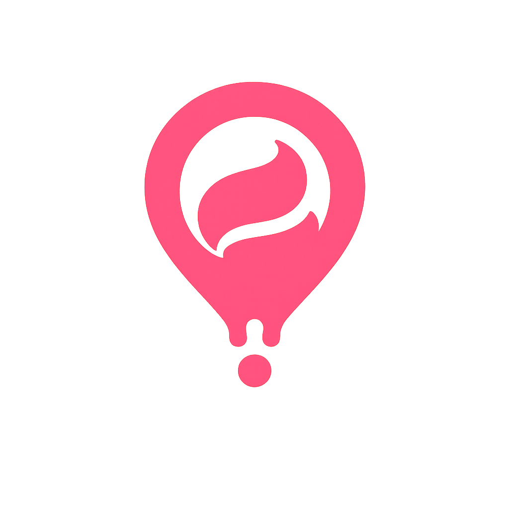

<p align="center">
  
</p>

<h1 align="center">Gelatino</h1>

<p align="center">
  <strong>La piattaforma mobile premium dedicata alla scoperta ed al tracciamento del gelato artigianale d'eccellenza.</strong>
</p>

<p align="center">
  <a href="https://flutter.dev"></a>
  <a href="https://firebase.google.com"></a>
  
</p>

---

## 📖 Indice

1.  [✨ Core Highlights](#-core-highlights)
2.  [🎨 Il Brand System & Linee Guida](#-il-brand-system--linee-guida)
3.  [📋 Lista Funzioni (Specifiche delle Schermate)](#-lista-funzioni-specifiche-delle-schermate)
4.  [💻 Comandi Tecnici & Guida Sviluppatori](#-comandi-tecnici--guida-sviluppatori)
5.  [📄 Licenza](#-licenza)

---

## ✨ Core Highlights

Gelatino non è una directory di gelaterie o un database caotico. È un prodotto lifestyle focalizzato sulla qualità artigianale e sull'esperienza fisica del gusto.

*   🍦 **Aesthetics First ("Creamy Flat")**: Estetica solida, pastello, pulita, ispirata alle riviste editoriali di pasticceria di lusso.
*   📔 **Collection-First**: All'avvio l'utente atterra sulla propria collezione personale (gelaterie da provare + gusti preferiti). Discovery (mappa) e social (bacheca) a un tap.
*   🏆 **Livello goloso (gamification)**: I "Punti gusto" (check-in, gelaterie uniche, recensioni 5★) fanno salire i livelli per **Formati**: Leccata → Coppetta → Cono → Vaschetta → Carretto.
*   📍 **Mappa con marker semantici**: Le gelaterie sul Melt Pin colorato per stato (preferite, salvate, mi piace, aggiunte da te).
*   🎯 **The Melt Pin Philosophy**: L'identità ruota attorno al **Melt Pin**, fusione tra pin geografico e gelato mantecato. Nell'header è anche scorciatoia al check-in veloce.
*   📳 **Tactile & Haptic Feedbacks**: Micro-interazioni con feedback aptico calibrato (chip, voto, check-in, successo).
*   🇮🇹 **Copy in italiano naturale**: Niente gergo da startup; tono caldo e concreto.

---

## 🎨 Il Brand System & Linee Guida

Direzione del marchio e sorgenti in [brand/](brand/). Master degli asset in [brand/assets/source](brand/assets/source); in `assets/images/` solo gli asset effettivamente usati dall'app.

### Palette Colori Ufficiale (Gusti Gelatino)
Token in [app_theme.dart](lib/theme/app_theme.dart):

| Gusto | HEX | Ruolo nella UI |
| :--- | :--- | :--- |
| **Fior di Panna** | `#FAFAFA` | Sfondo chiaro principale |
| **Fondente Extra**| `#1A1A1A` | Sfondo scuro, testi, marker default |
| **Fragola Pop**   | `#FF4D6D` | Accento primario: CTA, "Mi piace" |
| **Menta Glaciale**| `#00E6B8` | Stato "Salvati / da provare" |
| **Puffo Elettrico**| `#00BFFF` | Gelaterie aggiunte dall'utente |
| **Sorbetto Yuzu** | `#FFEA00` | Stato "Preferiti" |

### Semantica colori stati (coerente ovunque: marker, bottoni, filtri)
Mi piace → **Fragola** · Preferiti → **Sorbetto** · Salvati/da provare → **Menta** · Aggiunte dall'utente → **Puffo** · Default/ufficiali → **Fondente**. Dettagli in [visual-system.md](brand/guidelines/visual-system.md).

### Regole Rapide del Marchio
*   **No Pure Black:** mai `#000000`; usare `Fondente Extra`.
*   **Logo Integrity:** Melt Pin sempre forma piena; niente outline, ombre pesanti o distorsioni.

---

## 📋 Lista Funzioni (Specifiche delle Schermate)

### 1. Accesso (`LoginScreen`)
*   **Google Auth con Firebase**; su web `signInWithPopup` per preservare lo stato.
*   **Branding d'ingresso:** Melt Pin (`simple-pin.svg`) sopra la schermata.

### 2. Dashboard (`MainScreen`)
*   **Header centrato:** titolo sezione perfettamente centrato (Stack); a sinistra il **Melt Pin** (più grande) come scorciatoia al **check-in veloce** (haptic + badge "+"), a destra l'avatar.
*   **Navigazione a 4 tab:** Collezione · Bacheca · Gelaterie · Amici. Default su Collezione.
*   **Floating Pill Navigation** con `BackdropFilter`; su desktop sidebar verticale. Stato attivo in Fragola Pop.

### 3. Collezione (`CollectionScreen`) — landing
*   **Da provare:** gelaterie salvate (wishlist), con accento Menta.
*   **Gusti preferiti:** gestore completo dei gusti (vedi sotto), accento Sorbetto.

### 4. Bacheca (`TimelineScreen`)
*   Feed dei check-in propri e degli amici. Card editoriali con foto 16:9, rating, note, chip gusti **colorate dal colore del gusto**.

### 5. Gelaterie (`PlacesTab`)
*   **Dual-View:** pills Lista/Mappa in alto; **ricerca e filtri sotto** le pills.
*   **Filtri per stato:** Tutte · Mi piace · Preferiti · Salvati · Aggiunte da me (validi in lista e mappa).
*   **Marker semantici:** Melt Pin colorato per stato (`pin-*.svg`); precedenza preferiti > salvati > mi piace > aggiunte > default.
*   **Aggiungi gelateria:** pulsante Puffo → dialog (nome, indirizzo, posizione GPS); la nuova gelateria è marcata come aggiunta dall'utente.
*   Tile vettoriale OpenStreetMap o satellitare ArcGIS.

### 6. Creazione Check-in (`CheckInScreen`)
*   **Upload JPEG compresso** (pacchetto `image`, ridimensionamento + `cache-control`) su Firebase Storage — leggero, evita sprechi di quota. La compressione gira in un isolate (inline su web), applica l'orientamento EXIF ai pixel e rimuove tutti i metadati EXIF (GPS incluso).
*   **Inquadratura 16:9** dopo la scelta della foto (trascina e zoom): è lo stesso formato della card in bacheca, quindi l'autore vede esattamente cosa vedranno gli amici.
*   **Progresso dell'upload** in percentuale durante il caricamento privato.
*   **Colore medio della foto** calcolato in fase di compressione, salvato come `photo_color` dal server e usato come placeholder nella card mentre la foto si carica.
*   **Cache delle immagini** per foto e avatar pubblicati (path versionati, immutabili): su disco in mobile/desktop, in Cache Storage sul web. Svuotata al logout. La bacheca precarica le foto delle card successive.
*   Associazione a gelateria esistente/nuova; gusti con chip interattivi; sequenza aptica al successo.
*   **Formato del gelato:** catalogo Firestore con chip personalizzate, selezione singola obbligatoria e lista espandibile.

### 7. Apri in Mappe (`PlaceDetailScreen`)
*   **Apertura esterna:** Web → Google Maps in nuova scheda; iOS → Apple Maps; Android → `geo:`/Google Maps in app esterna.

### 8. Da provare (`WishlistScreen`) & Amici (`FriendsScreen`)
*   **Da provare:** swipe-to-delete con annulla.
*   **Amici:** ricerca asincrona, invito esterno via link, scorciatoia "Gelatino?" (proposta di gelato) con filtri Invitati / Da invitare.

### 9. Profilo & Livello (`ProfileScreen`)
*   **Statistiche dinamiche:** stat **hero** (Gelati, count-up animato) + secondarie (Gelaterie, Media voti, Mi piace, Amici, Gusto top).
*   **Formato preferito:** stat sintetica calcolata dai check-in con spareggio sull'utilizzo più recente.
*   **Il mio livello goloso:** barra di avanzamento gamificata coi livelli "Formati" e i Punti gusto.
*   **Gestione gusti** (in Collezione e schermata dedicata): catalogo condiviso (~40 gusti di default), aggiunta con **palette colori**, pill colorate, **preferito** con stella, ricerca, ordine A-Z / Ultimo assaggiato, filtro Preferiti.
*   **Impostazioni:** modifica profilo, tema (Chiaro/Scuro/Sistema).

---

## 💻 Comandi Tecnici & Guida Sviluppatori

### Albero del Progetto
```
gelatino/
├── brand/
│   ├── assets/source/   # Master di tutti gli asset (PNG + SVG)
│   ├── assets/exports/  # Export generati
│   └── guidelines/      # Linee guida (identity, visual-system, product-ui, strategy)
├── assets/
│   ├── data/            # rome_places.json (307), default_flavors.json (~40)
│   └── images/          # Solo asset in uso: logo.svg, logo-white.png, simple-pin.svg, pin-*.svg
├── lib/
│   ├── constants/       # Stringhe statiche
│   ├── models/          # CheckIn, Place, UserProfile, Flavor, GelatoLevel
│   ├── providers/       # Riverpod (places, flavors, navigation, ...)
│   ├── screens/         # Pagine UI (collection_screen, ...)
│   ├── theme/           # Temi e token
│   ├── widgets/         # Riutilizzabili (FlavorsManager, CreamyCard, ...)
│   └── main.dart
├── functions/           # Cloud Functions (TypeScript): callable, trigger, regole
└── test/
```

### Setup (obbligatorio al primo clone)

Le configurazioni Firebase **non sono nel repo**: contengono le chiavi client
del progetto e vanno generate sul tuo. Serve un progetto Firebase con Auth,
Firestore, Storage e Cloud Messaging attivi.

```bash
flutter pub get
dart pub global activate flutterfire_cli
flutterfire configure --project=IL_TUO_PROGETTO
```

Il comando scrive `lib/firebase_options.dart`,
`android/app/google-services.json` e `ios/Runner/GoogleService-Info.plist`.

Solo per il web, il service worker delle notifiche va compilato a mano:

```bash
cp web/firebase-messaging-sw.js.template web/firebase-messaging-sw.js
# poi incolla i valori del blocco `web` di lib/firebase_options.dart
```

Infine pubblica le regole e gli indici:

```bash
firebase deploy --only firestore:rules,firestore:indexes,storage --project IL_TUO_PROGETTO
```

Su web foto e avatar si leggono con `getData()` (nessun download token
pubblico), che il browser blocca se il bucket non ha una policy CORS. Senza
questo passo le immagini restano sull'icona di errore. Aggiorna le origini in
[storage.cors.json](storage.cors.json) se usi altri domini, poi:

```bash
gcloud storage buckets update gs://IL_TUO_BUCKET --cors-file=storage.cors.json
# in locale usa la stessa porta dichiarata nel file:
flutter run -d chrome --web-port 5000
```

### Esecuzione & Test
```bash
flutter analyze
flutter test
flutter run            # dispositivo/simulatore
flutter run -d chrome --web-port 5000  # web (porta ammessa dal CORS)

cd functions && npm install && npm test   # test delle Cloud Functions
```

### Compilazione & Deploy Web (Firebase)
```bash
flutter build web --release --dart-define=APP_CHECK_WEB_KEY=LA_TUA_SITE_KEY
firebase deploy --only hosting --project IL_TUO_PROGETTO
```

**Ordine di deploy:** client prima, poi Functions. I check-in nuovi hanno il
campo opzionale `photo_color`, che le versioni dell'app precedenti non
riconoscono.

### App Check

L'app attiva App Check all'avvio (reCAPTCHA Enterprise su web, Play Integrity
su Android, DeviceCheck su iOS, provider di debug nelle build di debug).
L'attivazione da sola non blocca nulla. Per arrivare all'enforcement:

1. Firebase Console → App Check: registra le app. Per il web crea una chiave
   reCAPTCHA Enterprise e passala in build con `APP_CHECK_WEB_KEY` (senza
   chiave, su web App Check resta spento).
2. Nelle build di debug il token di debug compare nei log: registralo in
   console.
3. Controlla in console le metriche delle richieste verificate. Quando quasi
   tutto il traffico è verificato, attiva l'enforcement per Firestore e
   Storage dalla console e per le callable con `ENFORCE_APP_CHECK=true` in
   `functions/.env`, poi rideploya le Functions.

### Telemetria errori immagine

Gli errori di caricamento, decodifica e upload delle immagini arrivano alla
callable `reportClientFailure` e finiscono in Cloud Logging come
`client_media_failure`, con solo tipo, codice d'errore e piattaforma: niente
path, niente cookie. Per un grafico crea una metrica basata sui log con il
filtro `jsonPayload.message="client_media_failure"`.

---

## 📄 Licenza

[MIT](LICENSE) © Marco Cipriani. Il marchio, il logo e gli asset in
[brand/](brand/) restano di proprietà dell'autore e non sono coperti dalla
licenza del codice.

---

*Fatto con passione e golosità* 🍧🇮🇹
